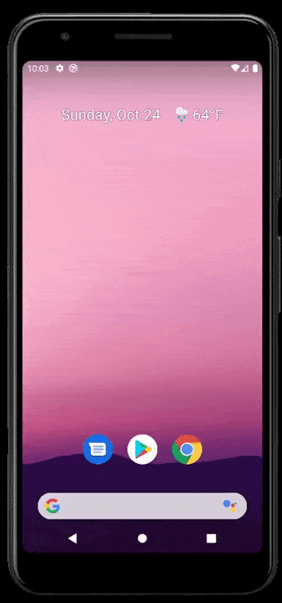

<h1 align="center"> Cicle</h1>


<p align="center">
  <a href="#tecnologias-">Tecnologias</a>&nbsp;&nbsp;&nbsp;|&nbsp;&nbsp;&nbsp;
  <a href="#sobre-">Sobre</a>&nbsp;&nbsp;&nbsp;|&nbsp;&nbsp;&nbsp;
  <a href="#layout-">Layout</a>&nbsp;&nbsp;&nbsp;|&nbsp;&nbsp;&nbsp;
  <a href="#instalação-">Instalação</a>&nbsp;&nbsp;&nbsp;|&nbsp;&nbsp;&nbsp;
  <a href="#funcionalidades-">Funcionalidades</a>
</p>
<p align="center"> 
Cicle é uma startup que permite vender materiais reciclados com facilidade, descartando aquilo que não se é usado por um preço justo.


</p>
<p align="center">

</p>


## Tecnologias :rocket: 

Esse projeto foi desenvolvido com as seguintes tecnologias:

- Flutter
- Firebase
- Dart

---

## Sumário 🛰

- [Sobre 📖](#sobre-)
- [Instalação 👷‍♂️](#instalação-%EF%B8%8F)
- [Funcionalidades 🛠✨](#funcionalidades-)

---

## Sobre 📖


### Descrição
A Cicle é um projeto de startup de impacto positivo que, através do aplicativo, permite pessoas venderem seu lixo doméstico e ainda gerarem um renda extra com isso. Esses resíduos são transformados em máteria-prima, que são aproveitadas no processo produtivo de outras empresas, trazendo economia de recursos como água, energia, matérias-primas retiradas da natureza e, ainda, estimula a destinação correta dos resíduos, minimizando impactos ambientais.

Esse é o aplicativo mobile desenvolvido com React Native, em javascript. Você pode encontrar o backend criado com node.js e typescript [aqui](https://github.com/Stardust-Cruzaders/Imora-Backend)

### Objetivo
O projeto foi desenvolvido como trabalho de conclusão de curso do 3º Ano do ensino médio integrado ao técnico na FIAP School. 

### O que eu aprendi 👨‍🏫

- JavaScript em prática.
- Usar elementos de UI e design com FlexBox.
- Implementação de sistemas de navegação.
- Implementar funcionalidade de seleção de fotos da galeria.
- 
---

##  Layout 🔖

Nos links abaixo você encontra o layout do projeto:

- [Layout](https://www.figma.com/file/yDjoNKatZiGCO3JS8961VJ/Cicle-App-Design?node-id=1%3A1726)

---

## Instalação 💻


Antes de começar, verifique se você atende aos seguintes requisitos:

- Versão mais recente do Flutter

 Para instalar o aplicativo, siga estas etapas:


```
- Clone this repository:
$ git clone https://github.com/DavidAugustoo/Cicle

- Enter in directory:
$ cd Cicle

- For install dependencies:
$ flutter packages get

- Run the app: 
$ flutter run
```
---

## Funcionalidades 🛠✨

- Autenticação por conta Google.
- CRUD completo de artigos.
- CRUD completo de pedidos.
- Quiz sobre reciclagem.
- Envio de e-mail para o suporte direto do aplicativo.

---

## 📫 Como contribuir
<!---Se o seu README for longo ou se você tiver algum processo ou etapas específicas que deseja que os contribuidores sigam, considere a criação de um arquivo CONTRIBUTING.md separado--->
Para contribuir com Cicle, siga estas etapas:

1. Bifurque este repositório.
2. Crie um branch: `git checkout -b <nome_branch>`.
3. Faça suas alterações e confirme-as: `git commit -m '<mensagem_commit>'`
4. Envie para o branch original: `git push origin <nome_do_projeto> / <local>`
5. Crie a solicitação de pull.

Como alternativa, consulte a documentação do GitHub em [como criar uma solicitação pull](https://help.github.com/en/github/collaborating-with-issues-and-pull-requests/creating-a-pull-request).

Feito com ♥ by [David Augusto](https://github.com/DavidAugustoo)
